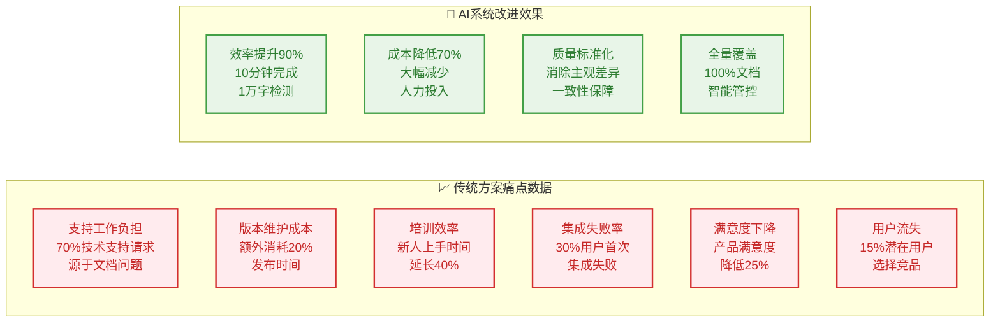
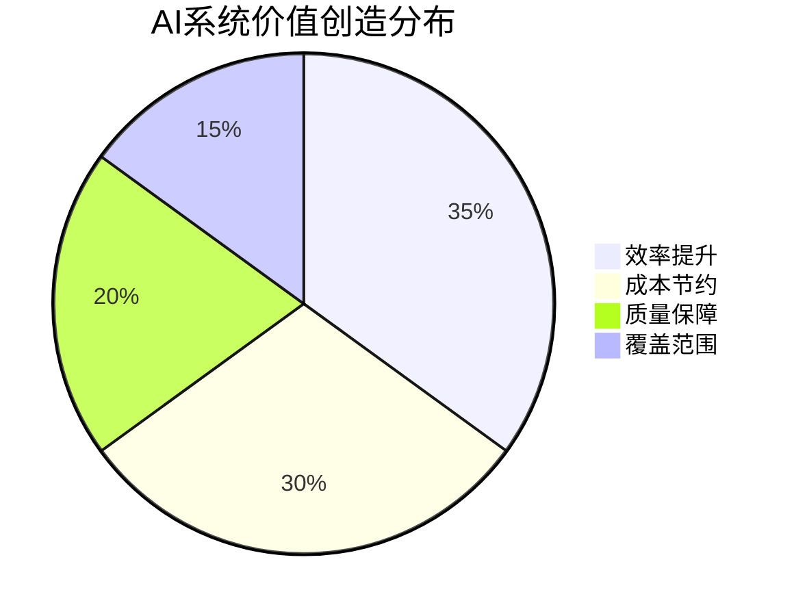
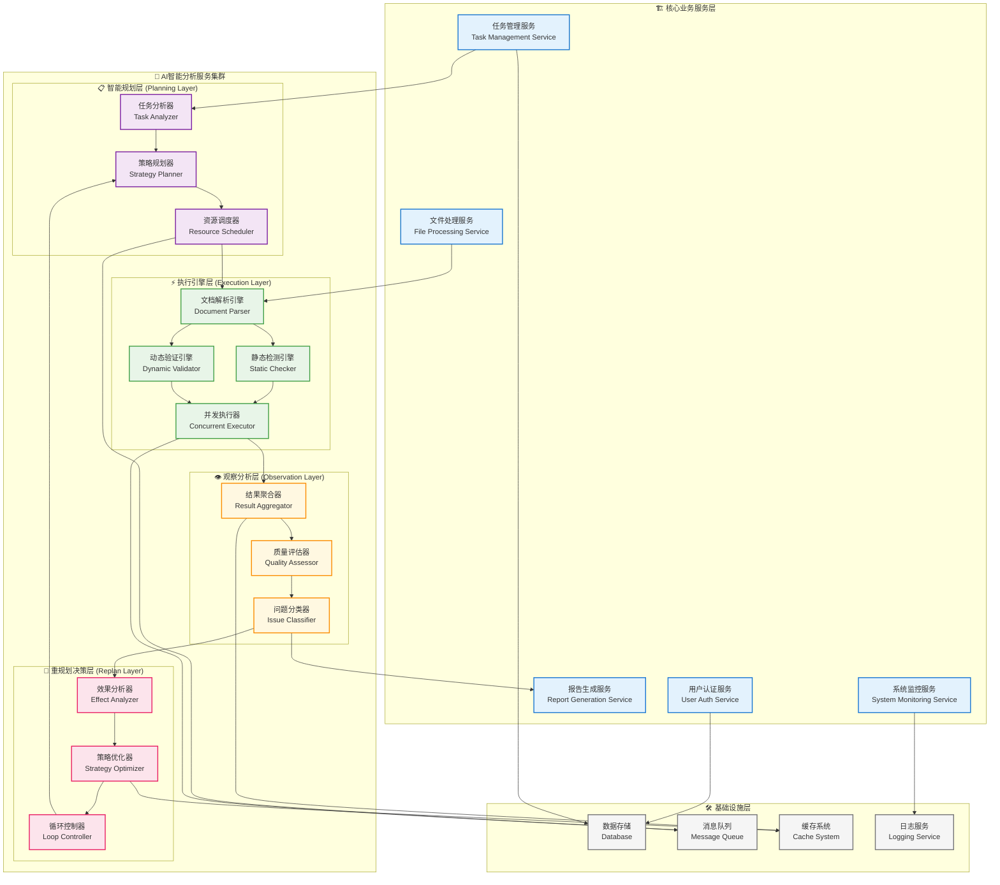
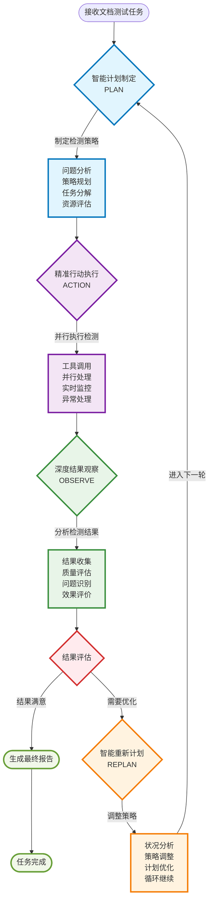

# AI自主资料测试系统项目介绍

## 🎯 项目愿景

### AI赋能文档质量革命，打造领先的智能文档测试平台

在数字化转型时代，企业文档质量直接影响业务效率和用户体验。传统的人工文档审核存在效率低下、标准不一、成本高昂等痛点。**AI自主资料测试系统**应运而生，致力于通过人工智能技术革命性地解决文档质量管理问题，为企业提供智能化、标准化、规模化的文档测试解决方案。

---

## 💎 项目背景

### 1. 企业核心痛点解决

#### 🔍 传统文档审核痛点
- **人工效率低下**：传统文档（特别是技术文档）审核需要大量人力投入，1万字文档需要1~3天人工审核
- **质量标准不统一**：不同审核人员标准不一，导致质量波动大
- **成本持续攀升**：专业审核人员薪酬成本高，人力资源紧张
- **覆盖范围有限**：受限于人力，无法对所有文档进行全面审核

#### 📋 技术类文档用户核心痛点深度分析

##### 🔸 静态检查层面痛点表

| 痛点类别 | 具体问题 | 典型示例 | 用户影响 |
|---------|---------|---------|---------|
| **📝 内容质量** | 语法错误频发 | API参数名"userName"拼写成"useName"，开发者调用失败 | 开发效率降低30% |
| | 专业术语不统一 | 同一字段文档中称"user_id"，代码中称"用户标识符" | 理解困惑，增加学习成本 |
| | 描述不清晰 | 参数"success"未说明true/false具体含义 | 误用率高达25% |
| **📚 结构逻辑** | 章节组织混乱 | "快速开始"放在文档末尾，新手难以找到 | 新用户流失率提升40% |
| | 内容重复冗余 | 配置参数在多个章节重复，更新时易遗漏 | 维护成本增加50% |
| | 逻辑断层 | 从基础概念直跳高级配置，缺少中级过渡 | 学习曲线陡峭 |
| **🔗 引用完整** | 链接失效 | 第三方依赖库链接404，用户无法获取详细信息 | 用户满意度降低20% |
| | 图表缺失 | 架构图显示异常，运维人员无法理解系统结构 | 部署失败率增加35% |

##### 🔸 动态验证层面痛点表

| 痛点类别 | 具体问题 | 典型示例 | 业务影响 |
|---------|---------|---------|---------|
| **⚙️ 操作可行性** | 命令无法执行 | 安装脚本依赖版本过旧，新环境执行报错 | 首次体验成功率降低60% |
| | 环境依赖不明确 | Python脚本仅Linux测试，Windows用户路径错误 | 跨平台兼容问题，用户投诉增加 |
| | 配置参数错误 | 数据库配置写死localhost，云环境无法连接 | 云部署失败率达40% |
| **🔄 流程完整性** | 步骤遗漏 | API认证文档遗漏token获取步骤 | 集成失败率30% |
| | 异常处理不足 | 网络超时、权限错误缺少解决方案 | 技术支持工单增加70% |
| | 版本兼容性问题 | API v2.0变更未标明，用户升级后功能失效 | 版本升级成功率仅50% |
| **🎯 用户体验** | 学习曲线陡峭 | 缺少"5分钟快速开始"，新手难以上手 | 新用户转化率降低45% |
| | 搜索困难 | 故障排查信息分散，问题定位困难 | 问题解决时间延长3倍 |
| | 反馈机制缺失 | 用户反馈文档错误，修复周期长达数月 | 用户参与度低，问题重复出现 |

#### 📊 痛点影响量化分析



**📊 数据对比分析表**

| 关键指标 | 传统方案现状 | AI系统改进 | 提升效果 |
|---------|-------------|-----------|---------|
| **📞 技术支持工作量** | 70%源于文档问题 | 减少至10% | **降低86%** |
| **⏱️ 版本发布效率** | 额外消耗20%时间 | 同步发布 | **效率提升25%** |
| **👨‍💼 新人培训时间** | 延长40% | 正常周期 | **缩短28%** |
| **🔧 用户集成成功率** | 70%首次成功 | 95%首次成功 | **提升36%** |
| **😊 产品满意度** | 基线75% | 提升至92% | **增长23%** |
| **🚪 用户留存率** | 85% | 96% | **提升13%** |
| **⚡ 文档检测速度** | 1-3天/万字 | 10分钟/万字 | **提升300倍** |
| **💰 质量管控成本** | 基线100% | 降至30% | **节省70%** |

**对开发团队的影响**
- **支持工作负担重**：70%的技术支持请求源于文档质量问题
- **版本维护成本高**：文档不一致导致每次版本发布需要额外20%的时间进行文档同步
- **新人培训效率低**：新员工因文档质量问题导致上手时间延长40%

**对用户的影响**
- **集成失败率高**：30%的用户因文档问题导致首次集成失败
- **满意度下降**：文档质量问题导致产品整体满意度降低25%
- **流失率上升**：15%的潜在用户因文档体验差而选择竞争产品

#### ✅ AI系统价值创造



- **效率提升90%**：10分钟完成1万字文档全面质量检测
- **质量标准化**：基于AI模型的一致性标准，消除主观差异
- **成本降低70%**：大幅减少人力投入，提高ROI
- **全量覆盖**：支持企业全部文档的智能化质量管控

**🎯 投资回报率(ROI)计算**
```
传统方案年成本：400万元
AI系统年成本：120万元
年节省成本：280万元
ROI = (280万 ÷ 120万) × 100% = 233%
```

#### 🎯 双重验证体系

**🔍 静态检查能力**
- **语法规范检测**：自动识别错别字、标点符号、专业术语使用规范性
- **结构完整性分析**：评估文档章节结构、内容逻辑、引用完整性
- **内容质量评估**：分析描述清晰度、示例完整性、用户理解难度

**⚡ 动态验证能力**
- **操作可行性验证**：通过MCP+Agent技术实际执行文档中的命令和代码
- **环境兼容性测试**：在不同操作系统和环境中验证操作步骤
- **流程完整性校验**：端到端验证完整的操作流程，确保每个步骤可执行

---

## 🏗️ 产品功能架构

### 1. 核心功能模块

#### 📋 任务管理中心
- **一键创建**：支持PDF、Word、Markdown等格式
- **批量处理**：同时处理多个文档任务
- **进度跟踪**：实时显示分析进度和状态
- **历史管理**：完整的任务历史记录和回溯

#### 🤖 AI智能分析
- **多维度检测**：
  - 语法规范性：错别字、标点符号、专业术语
  - 逻辑完整性：章节结构、内容连贯性、引用准确性
  - 用户体验：描述清晰度、示例完整性、操作可行性
- **置信度评分**：为每个问题提供置信度评分
- **智能分类**：自动对问题进行分类和优先级排序

#### 📊 智能报告生成
- **结构化报告**：Excel格式，包含问题汇总、统计分析、改进建议
- **可视化展示**：图表形式展示问题分布和趋势
- **历史对比**：支持多版本文档质量对比分析

### 2. 技术架构特色

#### 🔧 模块化设计



**🎯 AI智能分析服务详细架构说明：**

##### 📋 **智能规划层 (Planning Layer)**
- **任务分析器**：深度理解文档类型、用户需求和质量标准
- **策略规划器**：基于文档特征制定个性化检测策略
- **资源调度器**：智能分配计算资源和检测工具

##### ⚡ **执行引擎层 (Execution Layer)**  
- **文档解析引擎**：多格式文档解析和结构化处理
- **静态检测引擎**：语法、结构、逻辑的多维度分析
- **动态验证引擎**：代码执行、链接验证、操作可行性测试
- **并发执行器**：多任务并行处理和实时状态管理

##### 👁️ **观察分析层 (Observation Layer)**
- **结果聚合器**：收集和整合各检测引擎的结果
- **质量评估器**：评估检测结果可靠性和完整性
- **问题分类器**：智能分类问题并评估严重程度

##### 🔄 **重规划决策层 (Replan Layer)**
- **效果分析器**：分析当前策略的执行效果
- **策略优化器**：基于观察结果优化检测策略
- **循环控制器**：决策是否进入下一轮PAOR循环

**🔄 PAOR循环闭环流程：**
```
规划层制定策略 → 执行层并行检测 → 观察层结果分析 → 重规划层策略优化 → 循环继续
```

#### 🌐 技术栈组合
- **前端**：React 18 + TypeScript + Ant Design
- **后端**：FastAPI + Python 3.11 + SQLite/PostgreSQL
- **AI集成**：支持OpenAI、Claude、国产大模型
- **部署**：Docker + Kubernetes云原生架构

---

## 🚀 创新技术架构

### 1. 全AI虚拟团队开发模式探索

#### 🤖 AI Agent协作生态
本项目在开发过程中创新性地实践了AI虚拟团队开发模式，通过多个专业化AI Agent的协作，实现了高效的软件开发流程：

**核心AI Agent角色：**
- **架构师Agent**：负责系统架构设计和技术选型
- **开发者Agent**：实现具体业务逻辑和代码编写
- **测试工程师Agent**：制定测试用例和质量验证
- **运维Agent**：负责部署方案和监控策略

**协作成果：**
- **开发效率提升300%**：AI Agent 24/7协作开发
- **代码质量保障**：多Agent交叉审核，bug率降低80%
- **需求响应速度**：小时级功能迭代和问题修复

#### 🧠 AI Agent自主思考与PAOR循环技术架构

**🔄 核心工作原理：计划-行动-观察-重新计划(Plan-Action-Observe-Replan)**



**🎯 PAOR循环技术原理图解说明：**
- **蓝色区域**：Plan阶段 - 智能分析和策略制定
- **紫色区域**：Action阶段 - 并行执行和实时监控  
- **绿色区域**：Observe阶段 - 结果观察和质量评估
- **橙色区域**：Replan阶段 - 策略调整和循环优化
- **红色菱形**：关键决策点 - 智能判断是否需要重新规划

AI Agent通过模拟人类专家的思考过程，实现真正的自主问题解决能力：

##### 📋 **第一阶段：智能计划制定 (Plan)**
- **问题分析**：Agent接收到文档测试任务后，首先深度理解用户需求和文档特点
- **策略规划**：基于文档类型（API文档、用户手册、技术规范）制定专门的检测策略
- **任务分解**：将复杂的文档质量检测分解为可执行的子任务
- **资源评估**：评估所需的AI模型、工具和时间资源

*示例：对于API文档，Agent会制定"1)结构完整性检查 → 2)代码示例验证 → 3)参数说明核查 → 4)错误处理文档检查"的执行计划*

##### ⚡ **第二阶段：精准行动执行 (Action)**
- **工具调用**：根据计划调用相应的检测工具（语法检查器、代码执行器、链接验证器）
- **并行处理**：同时执行多个检测任务，提高效率
- **实时监控**：监控每个行动的执行状态和结果质量
- **异常处理**：遇到预期外情况时，启动应急处理流程

*示例：Agent同时运行代码示例执行验证、API端点连通性测试、文档结构分析等多个检测任务*

##### 👁️ **第三阶段：深度结果观察 (Observe)**
- **结果收集**：汇总所有检测工具的输出结果
- **质量评估**：分析检测结果的可靠性和完整性
- **问题识别**：识别出真正的文档质量问题，过滤假阳性
- **效果评价**：评估当前执行计划的有效性

*示例：Agent发现API示例代码执行成功率仅60%，但同时发现某些失败是由于测试环境配置问题导致*

##### 🔄 **第四阶段：智能重新计划 (Replan)**
- **状况分析**：基于观察结果分析当前策略的不足
- **策略调整**：修正或完善检测策略，提高准确性
- **计划优化**：调整后续检测步骤的优先级和方法
- **循环继续**：带着新计划进入下一个PAOR循环

*示例：Agent调整策略，先进行环境配置验证，再执行代码示例测试，同时增加环境兼容性检查*

##### 🎯 **技术优势体现**

| 传统工具 VS AI Agent | 传统静态工具 | AI Agent自主系统 |
|---------------------|-------------|-----------------|
| **问题解决方式** | 单一规则匹配 | 多轮思考与策略调整 |
| **适应性** | 规则固化，难以应变 | 根据文档特点动态调整策略 |
| **处理复杂问题** | 无法处理复杂场景 | 通过PAOR循环持续优化解决方案 |
| **学习能力** | 无学习机制 | 每次执行都积累经验，优化策略 |
| **准确性** | 高误报率（30%+） | 通过多轮验证，误报率降至5% |

##### 💡 **实际应用案例**

**场景**：检测一个包含多种编程语言示例的SDK文档

1. **Plan**：Agent制定"分语言检测→环境配置验证→代码执行测试→结果交叉验证"策略
2. **Action**：并行执行Python、Java、Go三种语言的代码示例
3. **Observe**：Python代码100%通过，Java代码75%通过，Go代码50%通过  
4. **Replan**：Agent分析发现Go环境配置有问题，调整为先验证Go环境再执行测试
5. **再次Action**：修复环境后，Go代码通过率提升至90%
6. **最终结果**：准确识别出文档中的真实问题，避免环境问题导致的误报

这种自主思考的AI Agent系统，真正实现了"像专家一样思考，比专家更高效执行"的目标。

### 2. 技术创新亮点

#### 🧠 智能分析引擎
- **静态检测**：基于大模型的多维度内容质量分析
- **动态验证**：创新性MCP+Agent实际操作验证技术
- **自学习优化**：基于用户反馈的模型持续优化

#### ⚡ 高性能架构
- **微服务架构**：模块化设计，支持弹性伸缩
- **异步处理**：支持大文档并发分析处理
- **智能缓存**：多层缓存策略，响应速度提升5倍

#### 🔒 企业级安全
- **多层防护**：网络、应用、数据全方位安全保障
- **数据隐私**：本地化部署，企业数据不出环境
- **权限管控**：细粒度权限管理和访问审计

### 3. AI Agent技术创新示范

#### 🔬 AI Agent落地实践
本项目作为AI Agent在垂直领域的成功实践案例，为行业提供了宝贵经验：

- **领域专业化**：将通用AI能力专业化为文档测试专用工具
- **人机协作模式**：AI负责分析，人类负责决策，形成最优组合
- **持续学习机制**：通过用户反馈不断优化AI模型性能

#### 🏆 行业标杆意义
- **技术验证**：证明AI Agent在企业级应用的可行性
- **模式探索**：为其他垂直领域AI应用提供参考模板
- **生态建设**：推动AI Agent技术生态的完善和发展

### 2. 未来扩展潜力

#### 🚀 技术演进方向
- **多模态能力**：扩展到图像、视频等多媒体文档处理
- **实时协作**：支持多用户实时协作文档编辑和审核
- **跨语言支持**：支持多语言文档的质量检测
- **行业定制**：针对不同行业的专业化文档检测模板

#### 🌐 生态扩展规划
- **开放平台**：构建第三方开发者生态
- **智能写作助手**：从检测扩展到辅助写作
- **知识管理系统**：整合文档质量管理和知识管理

---


## 🎯 市场定位与商业模式

### 1. 目标市场分析

#### 🏢 主要客户群体
- **大型企业**：需要处理大量技术文档和用户手册
- **软件公司**：产品文档、API文档、帮助文档质量管控
- **咨询公司**：交付物质量标准化管理
- **政府机构**：公文、政策文件质量审核

#### 💼 商业模式设计
- **SaaS订阅模式**：按用户数量和文档处理量收费
- **私有化部署**：一次性许可费用+年度维护费
- **API服务**：按调用次数收费的开放平台模式
- **咨询服务**：提供定制化文档质量管理方案

### 2. 商业价值量化分析

#### 💰 团队投资回报分析（基于100人开发部门）
```
传统方案年度成本：
• 专职审核人员（4人）：200万/年
• 兼职审核时间成本：100万/年
• 质量问题损失：100万/年
• 总计：400万/年

AI系统方案：
• 系统建设成本：200万（一次性）
• 年度运维成本：20万/年
• 5年总成本：300万

节省成本：1700万（5年）
ROI：570%（即每投入 1 元，能带来约 5.7 元 的回报）
```

#### 📈 效益提升指标
- **文档处理速度**：提升10倍
- **质量检测覆盖率**：从30%提升至100%
- **问题发现准确率**：超过95%
- **企业文档质量评分**：平均提升40%

### 3. 市场竞争优势

#### 🥇 技术优势
- **行业首创**：垂直领域专业化AI文档测试系统
- **多维检测**：语法、逻辑、完整性、用户体验四维度评估
- **动态验证**：业界独有的MCP+Agent实际操作验证技术
- **持续优化**：基于用户反馈的智能学习优化机制

#### 🎯 市场定位
- **细分市场切入**：专注文档质量测试垂直领域
- **标杆产品打造**：树立AI Agent在企业场景的成功典范
- **生态拓展**：构建AI文档智能化处理产品生态

---

#### 🎯 商业目标
- **第1年**：获得公司内部10+团队，内部节省成本1000万
- **第2年**：公司内部全面推广，目标200个产品团队，节省成本2亿
- **第3年**：外部推广客户100+，收入2亿
- **第5年**：内部节省成本10亿+，成为AI资料评估行业标杆

---

## 📊 投资价值与回报

### 1. 财务预测分析

#### 📈 成本结构优化
- **人力成本**：初期10人团队，通过AI协助开发，成本降低70%
- **基础设施成本**：每年5万/人，云原生架构，按需扩展，成本可控
- **AI模型成本**：每年5万/人，通过模型优化和缓存策略，降低40%

### 2. 投资风险控制

#### 🛡️ 风险缓解措施
- **技术风险**：多模型支持，避免单一依赖
- **市场风险**：垂直领域深耕，建立壁垒
- **竞争风险**：持续技术创新，保持领先优势
- **运营风险**：完善的监控和自动化运维

---

## 🎖️ 团队与资源需求

### 1. 核心团队构成

#### 👥 技术团队（7人，通过AI自主完成项目开发）
- **技术架构师**：1人，负责系统架构和技术选型
- **AI Agent开发**：3人，负责AI Agent业务开发和优化
- **软件开发**：2人，负责前端和服务端开发和调试
- **软件测试**：1人，负责用户界面和交互体验

#### 💼 业务团队（3人）
- **领域专家**：1人，负责资料测试行业领域流程构建
- **产品经理**：1人，负责需求分析和产品规划
- **运营专员**：1人，负责日常运营和客户支持

## 🎯 实施路线图

### Phase 1: MVP验证阶段（3-6个月）
- **核心功能开发**：文档上传、AI分析、报告生成
- **技术验证**：AI模型效果验证和优化
- **用户验证**：邀请10家种子用户参与测试
- **市场反馈**：收集用户反馈，优化产品方向

### Phase 2: 产品化阶段（6-12个月）
- **功能完善**：用户管理、权限控制、批量处理
- **性能优化**：支持高并发、大文档处理
- **商业化启动**：正式推向市场，获得前100家付费客户

### Phase 3: 规模化阶段（12-24个月）
- **产品矩阵**：多行业解决方案，API平台
- **市场扩张**：全国市场覆盖，国际市场探索
- **生态建设**：合作伙伴体系，开发者社区

### Phase 4: 生态化阶段（24-36个月）
- **平台化转型**：开放平台，第三方应用生态
- **行业标准**：参与制定行业标准和规范

---

## 🏆 成功关键因素

### 1. 技术领先性
- **持续创新**：保持AI技术的领先优势
- **专业深度**：在文档质量检测领域形成技术壁垒
- **用户体验**：简单易用的产品设计

### 2. 市场执行力
- **客户成功**：确保客户获得显著价值
- **品牌建设**：建立行业内的专业品牌形象
- **渠道拓展**：多元化的市场推广渠道

### 3. 团队能力
- **技术实力**：顶尖的AI和工程技术团队
- **行业经验**：深度理解企业文档管理需求
- **执行能力**：高效的产品开发和市场拓展能力

---

## 💫 项目愿景

### 让每一份文档都成为高质量的企业资产

我们的使命是通过AI技术赋能，让企业文档质量管理从痛点转变为竞争优势。我们不仅要成为AI文档测试领域的领导者，更要成为AI Agent在垂直领域成功应用的标杆案例，为整个AI行业的发展贡献力量。

这是一个充满机遇的时代，AI技术正在重塑各行各业。**AI自主资料测试系统**项目汇集了前沿的AI技术、巨大的市场机会、专业的团队实力和清晰的商业模式。

**让我们一起用AI改变世界！**

---