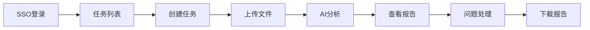
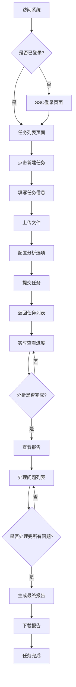
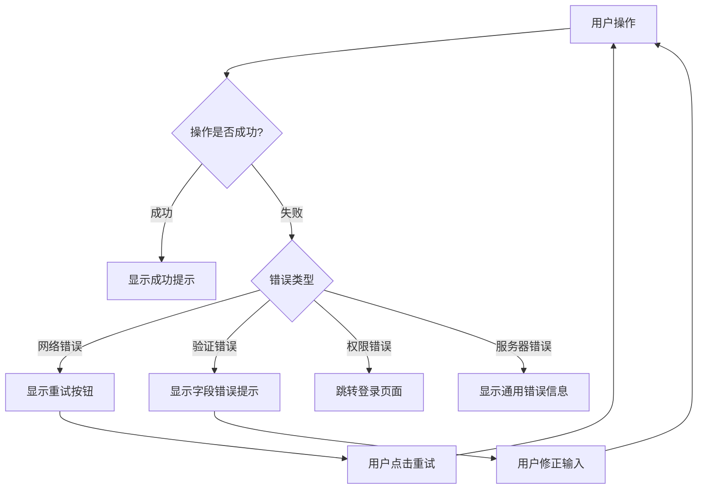

# AI资料测试系统 - 前端原型设计文档

## 📋 目录
1. [设计概述](#1-设计概述)
2. [整体布局设计](#2-整体布局设计)
3. [页面原型设计](#3-页面原型设计)
4. [用户交互流程](#4-用户交互流程)
5. [组件设计规范](#5-组件设计规范)
6. [响应式设计](#6-响应式设计)

---

## 1. 设计概述

### 1.1 设计理念
- 🎯 **用户友好**：直观的操作流程，减少学习成本
- 🚀 **高效操作**：最少步骤完成核心任务
- 📱 **响应式设计**：适配桌面和移动设备
- 🎨 **现代化UI**：基于Ant Design的专业界面

### 1.2 目标用户
- **主要用户**：技术文档编写者、产品经理、质量测试人员
- **使用场景**：文档质量检测、产品资料审核、内容优化
- **技术水平**：具备基础计算机操作能力

### 1.3 核心功能流程


---

## 2. 整体布局设计

### 2.1 主框架布局

```
┌─────────────────────────────────────────────┐
│                  Header                     │
│  [Logo]  [导航菜单]           [用户信息]    │
├─────────────────────────────────────────────┤
│          │                                  │
│   Side   │           Main Content          │
│   Menu   │                                  │
│          │                                  │
│          │                                  │
├─────────────────────────────────────────────┤
│                  Footer                     │
│              版权信息 | 帮助链接              │
└─────────────────────────────────────────────┘
```

### 2.2 布局组件说明

#### Header组件 (64px高度)
- **Logo区域**：系统名称和图标
- **导航菜单**：任务管理、报告中心、系统设置
- **用户信息**：头像、用户名、登出按钮

#### Sidebar组件 (200px宽度，可收缩)
- **任务管理**
  - 我的任务
  - 创建任务
  - 任务模板
- **报告中心**
  - 最近报告
  - 报告历史
  - 统计分析
- **系统设置**
  - 个人设置
  - 帮助文档

#### Main Content区域
- 动态内容展示区域
- 自适应宽度和高度
- 内置面包屑导航

---

## 3. 页面原型设计

### 3.1 登录页面

```
┌─────────────────────────────────────────────┐
│                                             │
│         🤖 AI资料测试系统                    │
│                                             │
│    ┌─────────────────────────────────────┐  │
│    │                                     │  │
│    │  欢迎使用AI资料测试系统              │  │
│    │                                     │  │
│    │  通过AI技术快速检测文档质量问题      │  │
│    │                                     │  │
│    │  ┌─────────────────────────────────┐│  │
│    │  │    🔐 企业SSO登录               ││  │
│    │  └─────────────────────────────────┘│  │
│    │                                     │  │
│    │  📝 支持格式：PDF、Word、Markdown    │  │
│    │                                     │  │
│    └─────────────────────────────────────┘  │
│                                             │
└─────────────────────────────────────────────┘
```

**页面功能**：
- 系统介绍和功能说明
- SSO登录按钮（跳转第三方认证）
- 支持格式说明
- 登录状态检查和自动跳转

### 3.2 任务列表页面

```
┌─────────────────────────────────────────────┐
│ 🏠 首页 > 任务管理                           │
├─────────────────────────────────────────────┤
│                                             │
│ 任务管理                        ┌─────────┐ │
│                               │ ➕ 新建任务│ │
│ ┌─────────┐ ┌─────────┐         └─────────┘ │
│ │📊 全部  │ │⏳ 进行中│ │✅ 已完成│ │❌ 失败 │ │
│ └─────────┘ └─────────┘ └─────────┘ └──────┘ │
│                                             │
│ ┌─────────────────────────────────────────┐ │
│ │ 📋 产品说明书质量检测    ⏰ 2024-01-15  │ │
│ │ 📁 5个文件              ⚡ 进行中 65%   │ │
│ │ ├── 产品介绍.pdf                       │ │
│ │ ├── 用户手册.docx                      │ │
│ │ └── README.md                          │ │
│ │                                        │ │
│ │ [📊 查看详情] [⏸️ 暂停] [🗑️ 删除]      │ │
│ └─────────────────────────────────────────┘ │
│                                             │
│ ┌─────────────────────────────────────────┐ │
│ │ 📋 API文档审核          ⏰ 2024-01-14  │ │
│ │ 📁 3个文件              ✅ 已完成       │ │
│ │ 🔍 发现 12 个问题                      │ │
│ │                                        │ │
│ │ [📄 查看报告] [⬇️ 下载] [🔄 重新分析]   │ │
│ └─────────────────────────────────────────┘ │
│                                             │
│ [1] [2] [3] ... [10]          共 89 个任务 │
└─────────────────────────────────────────────┘
```

**页面功能**：
- 任务状态筛选（全部、进行中、已完成、失败）
- 任务卡片展示（名称、文件数量、状态、进度）
- 快速操作（查看详情、暂停、删除、查看报告）
- 分页导航
- 新建任务按钮

### 3.3 创建任务页面

```
┌─────────────────────────────────────────────┐
│ 🏠 首页 > 任务管理 > 创建任务                 │
├─────────────────────────────────────────────┤
│                                             │
│ 创建新任务                                   │
│                                             │
│ ┌─────────────────────────────────────────┐ │
│ │ 📝 任务信息                             │ │
│ │                                        │ │
│ │ 任务名称 *                             │ │
│ │ ┌────────────────────────────────────┐ │ │
│ │ │ 产品文档质量检测                    │ │ │
│ │ └────────────────────────────────────┘ │ │
│ │                                        │ │
│ │ 任务描述                               │ │
│ │ ┌────────────────────────────────────┐ │ │
│ │ │ 检测产品说明书的内容质量和用户体验   │ │ │
│ │ └────────────────────────────────────┘ │ │
│ │                                        │ │
│ │ 任务类型 *                             │ │
│ │ ┌─────────┐ ┌─────────┐ ┌─────────┐   │ │
│ │ │🔵 质量检测│ │○ 内容审核│ │○ 用户体验│   │ │
│ │ └─────────┘ └─────────┘ └─────────┘   │ │
│ └─────────────────────────────────────────┘ │
│                                             │
│ ┌─────────────────────────────────────────┐ │
│ │ 📁 文件上传                             │ │
│ │                                        │ │
│ │ ┌───────────────────────────────────────┐│ │
│ │ │     拖拽文件到此处                    ││ │
│ │ │     或 [📎 选择文件]                  ││ │
│ │ │                                       ││ │
│ │ │ 支持格式：PDF、DOC/DOCX、MD           ││ │
│ │ │ 单文件最大：50MB                      ││ │
│ │ └───────────────────────────────────────┘│ │
│ │                                        │ │
│ │ 已选择文件：                            │ │
│ │ ✅ 产品介绍.pdf (2.5MB)     [🗑️]      │ │
│ │ ✅ 用户手册.docx (1.8MB)    [🗑️]      │ │
│ │ ⏳ README.md (0.5MB) 上传中... 45%    │ │
│ └─────────────────────────────────────────┘ │
│                                             │
│ ┌─────────────────────────────────────────┐ │
│ │ ⚙️ 分析配置                             │ │
│ │                                        │ │
│ │ 检测重点 (可多选)                       │ │
│ │ ☑️ 内容准确性  ☑️ 逻辑一致性            │ │
│ │ ☑️ 语言质量    ☑️ 用户友好性            │ │
│ │ ☐ 格式规范    ☐ 链接有效性             │ │
│ └─────────────────────────────────────────┘ │
│                                             │
│            [❌ 取消]    [🚀 开始分析]       │
└─────────────────────────────────────────────┘
```

**页面功能**：
- 任务基本信息填写
- 任务类型选择
- 拖拽式文件上传
- 上传进度显示
- 分析配置选项
- 表单验证和提交

### 3.4 任务详情页面

```
┌─────────────────────────────────────────────┐
│ 🏠 首页 > 任务管理 > 产品说明书质量检测       │
├─────────────────────────────────────────────┤
│                                             │
│ 📋 产品说明书质量检测    ⚡ 进行中          │
│ 📅 创建时间：2024-01-15 10:30              │
│                                             │
│ ┌─────────────────────────────────────────┐ │
│ │ 🚀 分析进度                             │ │
│ │                                        │ │
│ │ ████████████████░░░░  65%              │ │
│ │                                        │ │
│ │ 当前步骤：文档内容分析                   │ │
│ │ 预计剩余：8分钟                         │ │
│ │                                        │ │
│ │          [⏸️ 暂停]  [❌ 停止]           │ │
│ └─────────────────────────────────────────┘ │
│                                             │
│ ┌─────────────────────────────────────────┐ │
│ │ 📁 文件列表 (3个文件)                   │ │
│ │                                        │ │
│ │ ✅ 产品介绍.pdf        ✅ 分析完成      │ │
│ │    📊 8个问题发现                      │ │
│ │                                        │ │
│ │ ⏳ 用户手册.docx       🔄 分析中...     │ │
│ │    ████████░░░░ 75%                    │ │
│ │                                        │ │
│ │ ⏳ README.md           ⏰ 等待中        │ │
│ │    队列位置：#2                        │ │
│ └─────────────────────────────────────────┘ │
│                                             │
│ ┌─────────────────────────────────────────┐ │
│ │ 📊 实时统计                             │ │
│ │                                        │ │
│ │ 🔍 已发现问题：8个                      │ │
│ │ ├── 🔴 严重：2个                       │ │
│ │ ├── 🟡 一般：4个                       │ │
│ │ └── 🟢 轻微：2个                       │ │
│ │                                        │ │
│ │ ⏱️ 分析用时：15分钟                     │ │
│ │ 📈 整体评分：75/100                    │ │
│ └─────────────────────────────────────────┘ │
│                                             │
│ [📄 查看报告] [📋 任务设置] [🏠 返回列表]   │
└─────────────────────────────────────────────┘
```

**页面功能**：
- 任务基本信息展示
- 实时进度条和状态
- 文件列表和分析状态
- 问题统计预览
- 任务控制操作

### 3.5 报告查看页面

```
┌─────────────────────────────────────────────┐
│ 🏠 首页 > 任务管理 > 产品说明书质量检测 > 报告│
├─────────────────────────────────────────────┤
│                                             │
│ 📄 分析报告 - 产品说明书质量检测            │
│ 📅 生成时间：2024-01-15 11:45              │
│                                             │
│ ┌─────────────────────────────────────────┐ │
│ │ 📊 总体评估                             │ │
│ │                                        │ │
│ │ 🏆 综合评分：75/100                    │ │
│ │ 📁 检测文件：3个                       │ │
│ │ 🔍 发现问题：12个                      │ │
│ │ ✅ 通过检查：88%                       │ │
│ └─────────────────────────────────────────┘ │
│                                             │
│ ┌─────────────────────────────────────────┐ │
│ │ 🎯 问题分类统计                         │ │
│ │                                        │ │
│ │ ├── 🔴 严重问题：3个   [查看详情]       │ │
│ │ ├── 🟡 一般问题：6个   [查看详情]       │ │
│ │ └── 🟢 轻微问题：3个   [查看详情]       │ │
│ └─────────────────────────────────────────┘ │
│                                             │
│ ┌─────────────────────────────────────────┐ │
│ │ 📋 问题列表                             │ │
│ │                                        │ │
│ │ 🔴 [严重] 产品介绍.pdf - 第3页          │ │
│ │ 📝 技术参数描述不准确，可能误导用户      │ │
│ │ 💡 建议：核实并更新技术规格说明         │ │
│ │ 📍 位置：第3页第2段                    │ │
│ │                                        │ │
│ │ 你的处理：                             │ │
│ │ ┌─────────┐ ┌─────────┐ ┌─────────┐   │ │
│ │ │🟢 接受   │ │🔴 拒绝   │ │💬 评论   │   │ │
│ │ └─────────┘ └─────────┘ └─────────┘   │ │
│ │                                        │ │
│ │ ⭐ 评分：★★★★☆                        │ │
│ │ 💭 评论：________________________       │ │
│ └─────────────────────────────────────────┘ │
│                                             │
│ │ 🟡 [一般] 用户手册.docx - 第1章         │ │
│ │ ... (类似结构的其他问题)                │ │
│                                             │
│ 处理进度：8/12 已处理                      │
│                                             │
│ [⬅️ 上一个] [➡️ 下一个] [📊 统计] [⬇️ 下载] │
└─────────────────────────────────────────────┘
```

**页面功能**：
- 分析结果总览
- 问题分类和统计
- 逐个问题处理界面
- 用户反馈收集（接受/拒绝/评分/评论）
- 处理进度跟踪

### 3.6 最终报告页面

```
┌─────────────────────────────────────────────┐
│ 🏠 首页 > 报告中心 > 最终报告                 │
├─────────────────────────────────────────────┤
│                                             │
│ 📄 最终报告 - 产品说明书质量检测            │
│ 📅 生成时间：2024-01-15 14:20              │
│                                             │
│ ┌─────────────────────────────────────────┐ │
│ │ ✅ 报告生成完成                         │ │
│ │                                        │ │
│ │ 🎉 恭喜！您已完成所有问题的处理         │ │
│ │                                        │ │
│ │ 📊 处理统计：                          │ │
│ │ ├── ✅ 已接受：8个问题                 │ │
│ │ ├── ❌ 已拒绝：2个问题                 │ │
│ │ ├── 💬 有评论：6个问题                 │ │
│ │ └── ⭐ 平均评分：4.2/5.0               │ │
│ └─────────────────────────────────────────┘ │
│                                             │
│ ┌─────────────────────────────────────────┐ │
│ │ 📋 报告内容预览                         │ │
│ │                                        │ │
│ │ 1. 执行摘要                            │ │
│ │    - 检测文件：3个                     │ │
│ │    - 发现问题：12个                    │ │
│ │    - 用户确认：8个                     │ │
│ │                                        │ │
│ │ 2. 问题详情                            │ │
│ │    - 严重问题及处理建议                │ │
│ │    - 一般问题及优化方案                │ │
│ │    - 轻微问题及改进提示                │ │
│ │                                        │ │
│ │ 3. 改进建议                            │ │
│ │    - 优先级排序                       │ │
│ │    - 实施计划建议                     │ │
│ │    - 质量提升方案                     │ │
│ └─────────────────────────────────────────┘ │
│                                             │
│ ┌─────────────────────────────────────────┐ │
│ │ 📥 下载选项                             │ │
│ │                                        │ │
│ │ ┌─────────────┐ ┌─────────────┐       │ │
│ │ │📊 Excel报告 │ │📄 PDF报告   │       │ │
│ │ │完整数据     │ │阅读友好     │       │ │
│ │ │[⬇️ 下载]   │ │[⬇️ 下载]   │       │ │
│ │ └─────────────┘ └─────────────┘       │ │
│ └─────────────────────────────────────────┘ │
│                                             │
│ [🔄 重新分析] [📧 邮件发送] [🏠 返回首页]   │
└─────────────────────────────────────────────┘
```

**页面功能**：
- 完成状态确认
- 处理结果统计
- 报告内容预览
- 多格式下载选项
- 后续操作建议

---

## 4. 用户交互流程

### 4.1 完整业务流程



### 4.2 关键交互设计

#### 4.2.1 文件上传交互
1. **拖拽上传**
   - 拖拽文件到上传区域
   - 实时文件格式验证
   - 大小限制提示
   - 上传进度条显示

2. **批量上传**
   - 多文件同时选择
   - 队列化上传处理
   - 单个文件状态显示
   - 失败重试机制

#### 4.2.2 问题处理交互
1. **问题导航**
   - 左右切换问题
   - 进度指示器
   - 跳转到指定问题

2. **反馈收集**
   - 一键接受/拒绝
   - 星级评分组件
   - 文本评论输入
   - 实时保存草稿

#### 4.2.3 实时更新机制
1. **WebSocket连接**
   - 任务进度实时推送
   - 状态变更通知
   - 断线重连机制

2. **轮询备选**
   - 定时API调用
   - 状态对比更新
   - 网络异常处理

### 4.3 错误处理流程



---

## 5. 组件设计规范

### 5.1 基础组件库

#### 5.1.1 按钮组件
```typescript
// 主要按钮类型
type ButtonType = 'primary' | 'secondary' | 'danger' | 'ghost';

// 按钮尺寸
type ButtonSize = 'small' | 'middle' | 'large';

// 使用示例
<Button type="primary" size="middle" icon={<PlusOutlined />}>
  新建任务
</Button>
```

#### 5.1.2 状态标签组件
```typescript
// 任务状态配色
const StatusConfig = {
  pending: { color: '#faad14', text: '等待中' },
  running: { color: '#1890ff', text: '进行中' },
  completed: { color: '#52c41a', text: '已完成' },
  failed: { color: '#ff4d4f', text: '失败' }
};
```

#### 5.1.3 文件上传组件
```typescript
interface UploadProps {
  accept: string[];           // 接受的文件类型
  maxSize: number;           // 最大文件大小(MB)
  multiple: boolean;         // 是否支持多文件
  onProgress: (percent: number) => void;
  onSuccess: (file: File) => void;
  onError: (error: string) => void;
}
```

### 5.2 页面组件设计

#### 5.2.1 任务卡片组件
```typescript
interface TaskCardProps {
  id: string;
  title: string;
  description?: string;
  status: TaskStatus;
  progress?: number;
  fileCount: number;
  createdAt: Date;
  onView: (id: string) => void;
  onPause: (id: string) => void;
  onDelete: (id: string) => void;
}
```

#### 5.2.2 问题处理组件
```typescript
interface IssueItemProps {
  issue: {
    id: string;
    severity: 'high' | 'medium' | 'low';
    title: string;
    description: string;
    suggestion: string;
    location: string;
  };
  onAccept: (id: string) => void;
  onReject: (id: string) => void;
  onRate: (id: string, rating: number) => void;
  onComment: (id: string, comment: string) => void;
}
```

### 5.3 样式规范

#### 5.3.1 颜色系统
```css
:root {
  /* 主色调 */
  --primary-color: #1890ff;
  --primary-hover: #40a9ff;
  --primary-active: #096dd9;
  
  /* 功能色 */
  --success-color: #52c41a;
  --warning-color: #faad14;
  --error-color: #ff4d4f;
  --info-color: #1890ff;
  
  /* 中性色 */
  --text-primary: rgba(0, 0, 0, 0.85);
  --text-secondary: rgba(0, 0, 0, 0.65);
  --text-disabled: rgba(0, 0, 0, 0.25);
  
  /* 背景色 */
  --bg-primary: #ffffff;
  --bg-secondary: #fafafa;
  --bg-disabled: #f5f5f5;
}
```

#### 5.3.2 字体规范
```css
/* 字体大小 */
.text-xs { font-size: 12px; }    /* 辅助信息 */
.text-sm { font-size: 14px; }    /* 正文 */
.text-base { font-size: 16px; }  /* 标题 */
.text-lg { font-size: 18px; }    /* 大标题 */
.text-xl { font-size: 20px; }    /* 页面标题 */

/* 字重 */
.font-normal { font-weight: 400; }
.font-medium { font-weight: 500; }
.font-semibold { font-weight: 600; }
```

#### 5.3.3 间距系统
```css
/* 间距变量 */
.space-1 { margin: 4px; }
.space-2 { margin: 8px; }
.space-3 { margin: 12px; }
.space-4 { margin: 16px; }
.space-6 { margin: 24px; }
.space-8 { margin: 32px; }
```

---

## 6. 响应式设计

### 6.1 断点设置

```css
/* 断点定义 */
@media (max-width: 576px) { /* 手机端 */ }
@media (min-width: 577px) and (max-width: 768px) { /* 平板端 */ }
@media (min-width: 769px) and (max-width: 992px) { /* 小屏电脑 */ }
@media (min-width: 993px) { /* 大屏电脑 */ }
```

### 6.2 布局适配

#### 6.2.1 移动端适配
- **Sidebar收缩**：移动端隐藏侧边栏，通过抽屉组件展示
- **表格优化**：任务列表改为卡片式布局
- **按钮调整**：增大点击区域，优化触摸体验
- **文字缩放**：关键信息字体适当放大

#### 6.2.2 平板端适配
- **两栏布局**：保持侧边栏，主内容区域自适应
- **网格系统**：任务卡片采用2列布局
- **触摸优化**：增加触摸友好的交互元素

### 6.3 组件响应式设计

```typescript
// 响应式Hook示例
const useResponsive = () => {
  const [screenSize, setScreenSize] = useState('desktop');
  
  useEffect(() => {
    const handleResize = () => {
      const width = window.innerWidth;
      if (width < 576) setScreenSize('mobile');
      else if (width < 768) setScreenSize('tablet');
      else setScreenSize('desktop');
    };
    
    window.addEventListener('resize', handleResize);
    handleResize();
    
    return () => window.removeEventListener('resize', handleResize);
  }, []);
  
  return screenSize;
};
```

---

## 7. 交互动效设计

### 7.1 页面转场动效
- **路由切换**：淡入淡出效果（300ms）
- **模态框**：缩放+淡入效果（200ms）
- **抽屉组件**：滑动效果（300ms）

### 7.2 反馈动效
- **按钮点击**：波纹效果
- **加载状态**：骨架屏 + 脉冲动画
- **成功操作**：绿色对勾动画
- **错误提示**：红色抖动动画

### 7.3 数据更新动效
- **进度条**：平滑数值变化
- **计数器**：数字滚动效果
- **列表更新**：新增项目高亮显示

---

## 8. 可访问性设计

### 8.1 键盘导航
- 所有交互元素支持Tab键导航
- 明确的焦点指示器
- Enter/Space键触发操作
- Esc键关闭模态框

### 8.2 屏幕阅读器支持
- 语义化HTML标签
- 适当的ARIA标签
- 图片alt属性
- 表单标签关联

### 8.3 视觉无障碍
- 颜色对比度符合WCAG 2.1 AA标准
- 不仅依赖颜色传达信息
- 支持文字缩放至200%
- 适配高对比度模式

---

## 📊 总结

本前端原型设计文档基于MVP系统架构，提供了完整的用户界面设计方案：

### 🎯 核心特点
1. **用户体验优先**：简洁直观的操作流程
2. **响应式设计**：适配多种设备和屏幕尺寸  
3. **组件化架构**：可复用的UI组件库
4. **现代化界面**：基于Ant Design的专业外观

### 🚀 实施优势
- **快速开发**：基于成熟UI框架，开发效率高
- **一致性保证**：统一的设计规范和组件标准
- **用户友好**：符合用户习惯的交互模式
- **可维护性**：清晰的组件结构和代码规范

### 📈 扩展性
- 支持后期功能模块扩展
- 组件库可复用于其他项目
- 设计系统便于团队协作
- 技术架构支持长期演进

本设计为AI资料测试系统提供了完整的前端解决方案，确保用户能够高效、便捷地完成文档质量检测任务。

