# AI资料自主测试系统软件设计文档

## 📋 目录
1. [技术栈优化方案](#1-技术栈优化方案)
2. [系统架构设计](#2-系统架构设计)
3. [数据库设计](#3-数据库设计)
4. [API接口设计](#4-api接口设计)
5. [安全架构设计](#5-安全架构设计)
6. [部署架构设计](#6-部署架构设计)
7. [监控和运维方案](#7-监控和运维方案)

---

## 1. 技术栈优化方案

### 1.1 优化前后对比

| 组件类别 | 原方案 | 优化方案 | 优化理由 |
|---------|--------|----------|----------|
| **前端框架** | React/Vue.js + TypeScript | **React 18** + TypeScript + TanStack Query | 统一技术栈，更好的状态管理 |
| **后端框架** | FastAPI + Celery + asyncio | **FastAPI** + AsyncIO + Background Tasks | 统一异步架构，减少复杂性 |
| **数据库** | MySQL + Redis | **PostgreSQL** + Redis | 更好的JSON支持和扩展性 |
| **文件存储** | 本地文件系统 | **本地文件系统** + 分层设计 | 降低初期复杂度，支持后期扩展 |
| **AI框架** | Langchain + OpenAI | **LangChain** + **LiteLLM** + 多模型 | 统一接口，成本优化 |
| **消息队列** | Celery | **Apache Kafka** + AsyncIO | 更好的流处理和扩展性 |

### 1.2 优化后技术栈架构

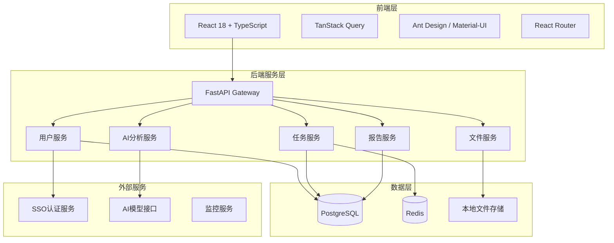

---

## 2. 系统架构设计

### 2.1 整体系统架构

以下架构图展示了AI资料自主测试系统的整体设计，采用分层架构模式，确保系统的可扩展性和可维护性。

**架构设计理念：**
- **分层解耦**：前端层、网关层、服务层、数据层独立部署，降低系统耦合度
- **服务化**：核心业务功能拆分为独立的微服务，便于独立开发和部署
- **数据分离**：业务数据、缓存数据、文件数据采用不同存储方案，优化性能
- **外部集成**：通过标准接口集成SSO认证、AI模型等外部服务

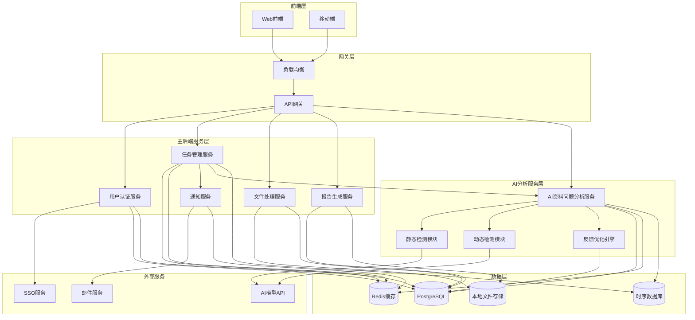

**架构说明：**

📱 **前端层**：提供多端访问能力，Web前端支持桌面办公场景，移动端适配移动办公需求。

🌐 **网关层**：负载均衡器实现流量分发和高可用，API网关提供统一的服务入口、认证鉴权和流量控制。

⚙️ **主后端服务层**：五大核心微服务相互协作：
- **认证服务**：处理用户身份验证和权限管理
- **任务服务**：管理测试任务的生命周期和状态
- **文件服务**：处理文档上传、存储和访问
- **报告服务**：生成和管理测试报告
- **通知服务**：提供系统消息和邮件通知

🤖 **AI分析服务层**：独立部署的智能分析引擎：
- **AI资料问题分析服务**：核心AI分析微服务，提供HTTP接口
- **静态检测模块**：基于提示词工程的文本内容分析
- **动态检测模块**：基于MCP+Agent的实际操作验证
- **反馈优化引擎**：持续学习和模型优化机制

💾 **数据层**：采用多存储架构，PostgreSQL存储业务数据，Redis提供缓存和会话管理，本地文件系统存储用户文档，时序数据库记录监控指标。

☁️ **外部服务**：集成企业SSO实现单点登录，对接多种AI模型API，通过邮件服务发送通知。

### 2.2 微服务架构设计

下图详细展示了各个微服务的内部组件结构和职责分工，体现了高内聚、低耦合的设计原则。

```mermaid
graph TB
    subgraph "AI资料测试系统"
        subgraph "用户认证微服务"
            AuthCtrl[认证控制器]
            JWTMgr[JWT管理器]
            UserRepo[用户存储库]
        end
        
        subgraph "任务管理微服务"
            TaskCtrl[任务控制器]
            TaskScheduler[任务调度器]
            StateMachine[状态机管理]
            TaskRepo[任务存储库]
        end
        
        subgraph "文件处理微服务"
            FileCtrl[文件控制器]
            FileParser[文件解析器]
            StorageMgr[存储管理器]
            FileRepo[文件存储库]
        end
        
        subgraph "AI分析微服务"
            AICtrl[AI分析控制器]
            StaticAnalyzer[静态检测分析器]
            DynamicAnalyzer[动态检测分析器]
            PromptEngine[提示词引擎]
            MCPConnector[MCP协议连接器]
            AgentFramework[Agent框架]
            OptimizationMgr[优化管理器]
            ModelSelector[模型选择器]
        end
        
        subgraph "报告生成微服务"
            ReportCtrl[报告控制器]
            TemplateEngine[模板引擎]
            Exporter[导出器]
            FeedbackProcessor[反馈处理器]
        end
    end

    subgraph "共享组件"
        ConfigMgr[配置管理]
        LogMgr[日志管理]
        ErrorHandler[错误处理]
        Metrics[监控指标]
    end

    AuthCtrl --> JWTMgr
    AuthCtrl --> UserRepo
    TaskCtrl --> TaskScheduler
    TaskCtrl --> StateMachine
    TaskCtrl --> TaskRepo
    FileCtrl --> FileParser
    FileCtrl --> StorageMgr
    FileCtrl --> FileRepo
    AICtrl --> StaticAnalyzer
    AICtrl --> DynamicAnalyzer
    AICtrl --> OptimizationMgr
    StaticAnalyzer --> PromptEngine
    StaticAnalyzer --> ModelSelector
    DynamicAnalyzer --> MCPConnector
    DynamicAnalyzer --> AgentFramework
    DynamicAnalyzer --> ModelSelector
    OptimizationMgr --> ModelSelector
    OptimizationMgr --> PromptEngine
    ReportCtrl --> TemplateEngine
    ReportCtrl --> Exporter
    ReportCtrl --> FeedbackProcessor

    AuthCtrl -.-> ConfigMgr
    TaskCtrl -.-> LogMgr
    FileCtrl -.-> ErrorHandler
    AICtrl -.-> Metrics
    ReportCtrl -.-> ConfigMgr
```

**微服务设计说明：**

🏗️ **服务拆分原则**：按照业务领域和数据边界进行服务拆分，每个微服务负责特定的业务功能，确保单一职责原则。

🔧 **内部组件**：
- **控制器层**：处理HTTP请求和响应，实现业务逻辑编排
- **分析器层**：静态检测分析器和动态检测分析器，执行具体的AI分析任务
- **引擎层**：提示词引擎、Agent框架等核心处理引擎
- **连接器层**：MCP协议连接器，负责与外部工具和服务的集成
- **管理器层**：优化管理器、模型选择器等业务管理组件
- **存储库层**：负责数据持久化和数据访问抽象

📦 **共享组件**：提供横切关注点的支持，包括配置管理、日志记录、错误处理和监控指标收集，通过依赖注入的方式被各微服务使用。

🔗 **服务间通信**：实线表示强依赖关系，虚线表示对共享组件的依赖，遵循松耦合原则，便于独立部署和扩展。

### 2.3 核心业务流程

以下时序图展示了用户从登录到获取最终报告的完整业务流程，涵盖了系统的主要交互路径和数据流转过程。

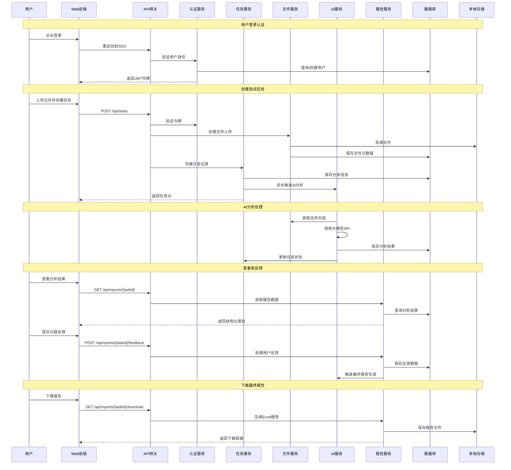

**业务流程说明：**

🔐 **用户认证阶段**：采用SSO单点登录，用户通过企业认证系统登录，系统自动获取用户信息并生成JWT令牌，实现安全的身份验证。

📁 **任务创建阶段**：支持批量文件上传和任务配置，文件先存储到本地文件系统，同时在数据库中记录文件元数据和任务信息，确保数据一致性。

🤖 **AI分析阶段**：异步处理模式，AI服务从文件服务获取文档内容，调用大模型API进行分析，将结果持久化存储，并更新任务状态，支持长时间运行的分析任务。

👥 **用户反馈阶段**：用户可以查看AI分析结果，对每个识别的问题进行接受、拒绝等操作，系统记录用户的反馈数据，为最终报告生成提供依据。

📊 **报告生成阶段**：结合AI分析结果和用户反馈，生成最终的Excel格式报告，支持报告下载和历史记录查看。

**关键设计特点：**
- 📈 **异步处理**：耗时的AI分析采用异步模式，避免阻塞用户操作
- 🔄 **状态管理**：完善的任务状态机，支持任务的启动、停止、重试等操作
- 💾 **数据持久化**：所有中间结果都进行持久化存储，支持任务恢复和审计
- 🔒 **权限控制**：每个API调用都进行身份验证和权限检查

---

## 3. AI资料问题分析服务设计

### 3.1 服务架构设计

AI资料问题分析服务作为独立的微服务，采用模块化设计，支持静态检测和动态检测两种分析模式，并提供持续优化的反馈机制。

**设计原则：**
- 🔧 **模块化架构**：静态检测、动态检测、优化引擎相互独立
- 📈 **可扩展性**：支持新的检测类型和AI模型的快速集成
- 🔄 **持续优化**：基于用户反馈的闭环优化机制
- 🚀 **高性能**：异步处理、并发执行、结果缓存

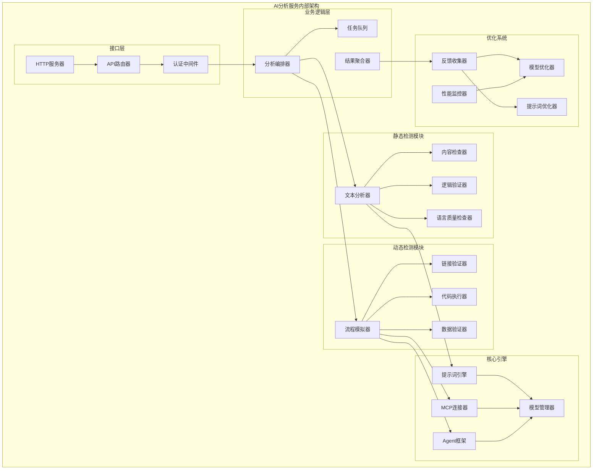

### 3.2 静态检测设计

**功能模块：**

🔍 **文本分析器**：
- **内容正确性检查**：验证技术描述的准确性和完整性
- **逻辑一致性验证**：检查前后文逻辑关系和论述连贯性
- **语言质量评估**：评估语法、用词、表达清晰度
- **用户友好性分析**：从用户角度评估内容可理解性

🛠️ **技术实现**：
```python
class StaticAnalyzer:
    def __init__(self):
        self.prompt_engine = PromptEngine()
        self.model_manager = ModelManager()
        
    async def analyze_content(self, content: str, analysis_type: str):
        # 选择合适的提示词模板
        prompt_template = self.prompt_engine.get_template(analysis_type)
        
        # 多轮分析策略
        results = []
        for check_type in ['accuracy', 'logic', 'language', 'usability']:
            prompt = prompt_template.format(content=content, check_type=check_type)
            result = await self.model_manager.call_model(prompt)
            results.append(self.parse_result(result, check_type))
        
        return self.aggregate_results(results)
```

### 3.3 动态检测设计

**功能模块：**

🤖 **流程模拟器**：
- **操作步骤验证**：模拟用户按照文档操作的完整流程
- **环境依赖检查**：验证所需环境和依赖的可用性
- **结果一致性验证**：对比实际执行结果与文档描述

🔗 **外部工具集成**：
- **MCP协议集成**：统一的工具访问协议
- **Agent框架**：智能化的任务执行代理
- **Function Calling**：结构化的工具调用机制

🛠️ **技术实现**：
```python
class DynamicAnalyzer:
    def __init__(self):
        self.mcp_connector = MCPConnector()
        self.agent_framework = AgentFramework()
        
    async def verify_operations(self, operations: List[Operation]):
        verification_results = []
        
        for operation in operations:
            # 通过Agent执行操作
            agent_result = await self.agent_framework.execute(
                operation.description,
                tools=operation.required_tools
            )
            
            # 验证执行结果
            verification = await self.verify_result(
                expected=operation.expected_result,
                actual=agent_result.output
            )
            
            verification_results.append({
                'operation': operation.name,
                'status': verification.status,
                'issues': verification.issues,
                'confidence': verification.confidence
            })
        
        return verification_results
```

### 3.4 反馈优化机制

**优化策略：**

📊 **数据收集**：
- 用户反馈数据（接受/拒绝问题的比例）
- 模型性能指标（响应时间、准确率）
- 问题分类统计（问题类型分布）
- 用户满意度评估（评分和评价）

🔄 **优化算法**：
- **模型选择优化**：基于任务类型和历史表现选择最佳模型
- **提示词进化**：基于反馈数据迭代改进提示词模板
- **阈值调整**：动态调整问题严重程度的判断阈值
- **权重优化**：调整不同检测维度的权重配比

🛠️ **技术实现**：
```python
class OptimizationEngine:
    def __init__(self):
        self.feedback_analyzer = FeedbackAnalyzer()
        self.model_selector = ModelSelector()
        self.prompt_optimizer = PromptOptimizer()
        
    async def optimize_based_on_feedback(self, feedback_data: FeedbackData):
        # 分析反馈数据
        analysis = await self.feedback_analyzer.analyze(feedback_data)
        
        # 模型性能优化
        if analysis.model_performance < THRESHOLD:
            await self.model_selector.update_selection_strategy(analysis)
        
        # 提示词优化
        if analysis.prompt_effectiveness < THRESHOLD:
            await self.prompt_optimizer.evolve_prompts(
                feedback_data.user_corrections
            )
        
        # 更新配置
        await self.update_analysis_config(analysis.recommendations)
```

### 3.5 服务接口设计

**RESTful API接口：**

```mermaid
graph TD
    A[AI分析服务API] --> B[分析接口]
    A --> C[模型管理]
    A --> D[提示词管理]
    A --> E[反馈优化]
    A --> F[系统管理]
    
    B --> B1["POST /analyze/static<br/>(静态检测)"]
    B --> B2["POST /analyze/dynamic<br/>(动态检测)"]
    B --> B3["POST /analyze/full<br/>(完整分析)"]
    B --> B4["GET /analyze/status/{taskId}<br/>(分析状态)"]
    B --> B5["GET /analyze/results/{taskId}<br/>(分析结果)"]
    
    C --> C1["GET /models<br/>(获取模型列表)"]
    C --> C2["POST /models/switch<br/>(切换模型)"]
    C --> C3["GET /models/performance<br/>(模型性能)"]
    
    D --> D1["GET /prompts<br/>(获取提示词模板)"]
    D --> D2["PUT /prompts/{id}<br/>(更新提示词)"]
    D --> D3["POST /prompts/test<br/>(测试提示词)"]
    
    E --> E1["POST /feedback<br/>(提交反馈)"]
    E --> E2["GET /optimization/metrics<br/>(优化指标)"]
    E --> E3["POST /optimization/trigger<br/>(触发优化)"]
    
    F --> F1["GET /health<br/>(健康检查)"]
    F --> F2["GET /metrics<br/>(性能指标)"]
    F --> F3["GET /logs<br/>(服务日志)"]
```

---

## 4. 数据库设计

### 4.1 数据库架构

数据库设计采用关系型数据库PostgreSQL作为主数据存储，充分利用其JSONB字段支持复杂的AI分析结果存储，同时保持良好的查询性能和数据完整性。

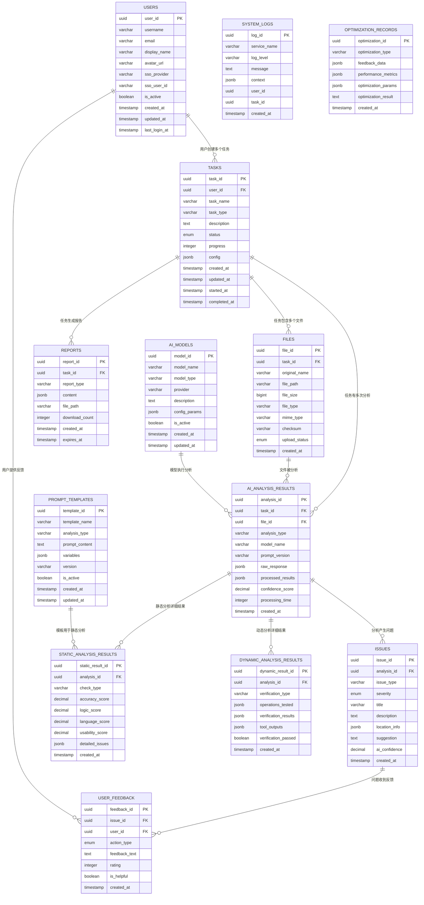

**数据模型设计说明：**

📊 **核心实体关系**：
- **用户中心**：USERS表作为核心，关联所有用户相关的数据
- **任务驱动**：TASKS表是业务流程的中心，管理整个测试任务生命周期
- **文件管理**：FILES表记录文件元数据，支持多文件任务
- **AI分析**：AI_ANALYSIS_RESULTS表存储分析过程和结果，支持多次分析
- **问题跟踪**：ISSUES表记录识别的问题，支持分类和优先级管理
- **用户反馈**：USER_FEEDBACK表记录用户对问题的处理结果
- **报告管理**：REPORTS表管理生成的各类报告文件

🤖 **AI分析服务扩展**：
- **模型管理**：AI_MODELS表管理可用的AI模型配置和状态
- **提示词管理**：PROMPT_TEMPLATES表存储和版本化提示词模板
- **静态分析**：STATIC_ANALYSIS_RESULTS表详细记录静态检测的各维度评分
- **动态分析**：DYNAMIC_ANALYSIS_RESULTS表记录动态验证的执行过程和结果
- **优化记录**：OPTIMIZATION_RECORDS表追踪系统优化的历史和效果

🔗 **关系设计特点**：
- **一对多关系**：用户→任务→文件/分析→问题→反馈，形成清晰的数据层次
- **JSONB支持**：利用PostgreSQL的JSONB字段存储复杂的AI分析结果和配置信息
- **审计追踪**：所有核心表都包含时间戳字段，支持数据变更追踪
- **UUID主键**：使用UUID作为主键，支持分布式环境和数据迁移

💾 **存储优化**：
- **索引策略**：在查询频繁的字段上建立复合索引
- **分区表**：对大数据量表（如系统日志）采用时间分区
- **JSON查询**：利用GIN索引优化JSONB字段的查询性能

### 3.2 Redis缓存设计

Redis作为高性能缓存和会话存储，采用多种数据结构优化不同场景的访问性能，支持分布式环境下的数据一致性。

```mermaid
graph TD
    subgraph "Redis缓存策略"
        A[用户会话缓存<br/>session:user:{user_id}]
        B[任务状态缓存<br/>task:status:{task_id}]
        C[文件上传进度<br/>upload:progress:{file_id}]
        D[AI分析队列<br/>queue:ai_analysis]
        E[实时通知队列<br/>notifications:{user_id}]
        F[热点数据缓存<br/>cache:reports:{task_id}]
        G[API限流计数<br/>ratelimit:{user_id}]
        H[分布式锁<br/>lock:task:{task_id}]
    end

    subgraph "过期策略"
        A --> |30分钟| I[自动过期]
        B --> |24小时| I
        C --> |1小时| I
        F --> |6小时| I
        G --> |1分钟| I
    end
```

**Redis缓存策略说明：**

🚀 **性能优化**：
- **会话缓存**：用户登录状态和权限信息，减少数据库查询
- **任务状态**：实时任务进度和状态信息，支持前端轮询
- **热点数据**：频繁访问的报告内容，提升查询响应速度

⏰ **过期策略**：
- **短期缓存**（1-30分钟）：API限流、上传进度等临时数据
- **中期缓存**（1-24小时）：任务状态、用户会话等业务数据
- **长期缓存**（6小时+）：报告内容等相对稳定的数据

🔄 **数据一致性**：
- **写入策略**：采用Write-Through模式，确保缓存与数据库一致
- **失效策略**：业务数据变更时主动清除相关缓存
- **分布式锁**：防止并发操作导致的数据冲突

📊 **监控指标**：
- **命中率**：监控缓存命中率，优化缓存策略
- **内存使用**：监控Redis内存使用情况，及时清理
- **响应时间**：跟踪缓存操作的响应时间

---

## 4. API接口设计

### 4.1 RESTful API规范

以下接口层次图展示了系统的完整API设计，按照模块化组织，遵循RESTful设计原则，提供清晰的接口层次结构。

```mermaid
graph TD
    A[API接口设计] --> B[认证模块 /api/v1/auth]
    A --> C[任务模块 /api/v1/tasks]
    A --> D[文件模块 /api/v1/files]
    A --> E[分析模块 /api/v1/analysis]
    A --> F[报告模块 /api/v1/reports]
    A --> G[系统模块 /api/v1/system]
    
    B --> B1["POST /login<br/>(SSO登录)"]
    B --> B2["POST /logout<br/>(用户登出)"]
    B --> B3["GET /profile<br/>(获取用户信息)"]
    B --> B4["PUT /profile<br/>(更新用户信息)"]
    B --> B5["POST /refresh<br/>(刷新令牌)"]
    
    C --> C1["GET /<br/>(获取任务列表)"]
    C --> C2["POST /<br/>(创建新任务)"]
    C --> C3["GET /{id}<br/>(获取任务详情)"]
    C --> C4["PUT /{id}<br/>(更新任务信息)"]
    C --> C5["DELETE /{id}<br/>(删除任务)"]
    C --> C6["POST /{id}/start<br/>(启动任务)"]
    C --> C7["POST /{id}/stop<br/>(停止任务)"]
    C --> C8["GET /{id}/progress<br/>(获取任务进度)"]
    
    D --> D1["POST /upload<br/>(上传文件)"]
    D --> D2["GET /{id}<br/>(获取文件信息)"]
    D --> D3["GET /{id}/download<br/>(下载文件)"]
    D --> D4["DELETE /{id}<br/>(删除文件)"]
    D --> D5["POST /{id}/parse<br/>(解析文件内容)"]
    D --> D6["GET /upload/progress/{id}<br/>(上传进度)"]
    
    E --> E1["POST /start<br/>(开始AI分析)"]
    E --> E2["GET /{id}/results<br/>(获取分析结果)"]
    E --> E3["GET /{id}/issues<br/>(获取问题列表)"]
    E --> E4["POST /{id}/reanalyze<br/>(重新分析)"]
    E --> E5["GET /models<br/>(获取可用模型)"]
    
    F --> F1["GET /{taskId}<br/>(获取报告内容)"]
    F --> F2["POST /{taskId}/feedback<br/>(提交用户反馈)"]
    F --> F3["POST /{taskId}/generate<br/>(生成最终报告)"]
    F --> F4["GET /{taskId}/download<br/>(下载报告)"]
    F --> F5["GET /{taskId}/history<br/>(报告历史版本)"]
    
    G --> G1["GET /health<br/>(健康检查)"]
    G --> G2["GET /metrics<br/>(系统指标)"]
    G --> G3["GET /config<br/>(系统配置)"]
    G --> G4["GET /version<br/>(版本信息)"]
```

**API设计规范说明：**

🔧 **设计原则**：
- **RESTful风格**：遵循REST架构原则，使用标准HTTP方法和状态码
- **版本控制**：采用URL版本控制（/api/v1/），支持向后兼容
- **模块化组织**：按业务模块划分API，便于维护和权限控制
- **统一响应格式**：标准化的JSON响应结构，包含状态码、消息和数据

📋 **模块功能**：
- **认证模块**：处理用户身份验证、授权和会话管理
- **任务模块**：提供任务的完整生命周期管理功能
- **文件模块**：支持文件上传、下载、解析和进度跟踪
- **分析模块**：管理AI分析流程和结果查询
- **报告模块**：处理报告生成、反馈收集和下载
- **系统模块**：提供健康检查、监控和配置查询

🔒 **安全设计**：
- **JWT认证**：所有业务接口都需要有效的JWT令牌
- **权限控制**：基于用户角色和资源所有权进行访问控制
- **输入验证**：严格的参数验证和SQL注入防护
- **速率限制**：防止API滥用和攻击

📊 **响应标准**：
```json
{
  "code": 200,
  "message": "Success",
  "data": {...},
  "timestamp": "2024-01-01T00:00:00Z"
}
```

### 4.2 文件存储设计方案

#### 4.2.1 本地文件存储设计
**设计理念：** 项目初期采用本地文件存储方案，降低系统复杂度，加速MVP开发。

**目录结构：**
```
/app/data/files/
├── users/
│   ├── {user_id}/
│   │   ├── tasks/
│   │   │   ├── {task_id}/
│   │   │   │   ├── uploads/      # 原始上传文件
│   │   │   │   ├── processed/    # 处理后的文件
│   │   │   │   └── reports/      # 生成的报告文件
│   │   │   │   └── temp/         # 临时文件
```

**核心特性：**
- 🗂️ **分层组织**：按用户/任务层级管理，便于权限控制
- 🔒 **安全隔离**：每个用户的文件独立存储，防止越权访问
- 📋 **文件类型管理**：区分原始文件、处理文件和报告文件
- 🔄 **版本控制**：支持文件的历史版本管理
- 📊 **访问日志**：记录所有文件操作，便于审计

#### 4.2.2 存储接口抽象层
```python
from abc import ABC, abstractmethod
from typing import Optional

class FileStorageInterface(ABC):
    """文件存储接口抽象层，便于后期扩展"""
    
    @abstractmethod
    async def upload_file(self, user_id: str, task_id: str, 
                         file_name: str, content: bytes) -> str:
        """上传文件并返回文件ID"""
        pass
    
    @abstractmethod
    async def download_file(self, file_id: str) -> Optional[bytes]:
        """根据文件ID下载文件内容"""
        pass
    
    @abstractmethod
    async def delete_file(self, file_id: str) -> bool:
        """删除指定文件"""
        pass
    
    @abstractmethod
    async def get_file_info(self, file_id: str) -> Optional[FileInfo]:
        """获取文件元信息"""
        pass

class LocalFileStorage(FileStorageInterface):
    """本地文件存储实现"""
    # 具体实现...
```

#### 4.2.3 扩展升级路径
| 阶段 | 存储方案 | 适用场景 | 优势 |
|------|----------|----------|------|
| **MVP阶段** | 本地文件存储 | 用户数 < 1000 | 简单快速，开发成本低 |
| **成长阶段** | 本地存储 + 云备份 | 用户数 1000-10000 | 数据安全，灾难恢复 |
| **扩展阶段** | 对象存储（MinIO/S3） | 用户数 > 10000 | 高可用，水平扩展 |

**升级步骤：**
1. 保持接口抽象层不变
2. 实现新的存储适配器
3. 数据迁移工具开发
4. 灰度切换验证

### 4.3 WebSocket实时通信

为了提供更好的用户体验，系统采用WebSocket技术实现实时通信，支持任务进度推送、状态更新和系统通知等功能。

**实时通信场景：**
- 📊 **任务进度**：实时推送AI分析进度和状态变化
- 🔔 **系统通知**：即时推送重要消息和警告信息
- 📈 **状态更新**：文件上传进度、任务状态变更等
- ⚠️ **错误提醒**：及时通知用户操作异常和系统错误

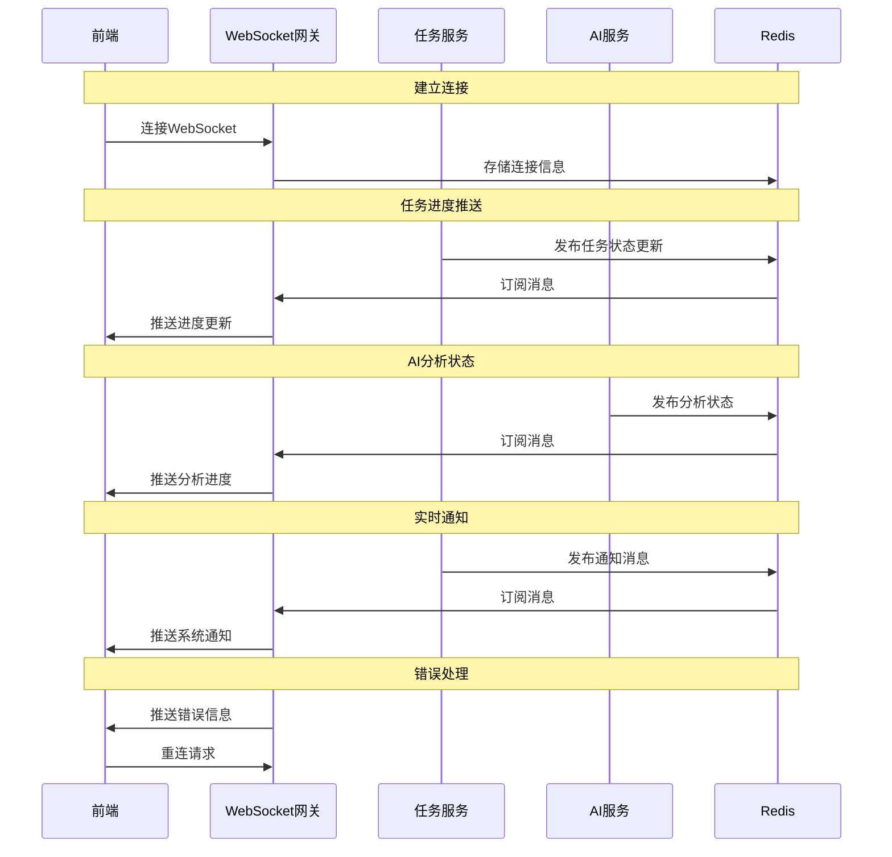

**WebSocket通信设计说明：**

🔄 **通信机制**：
- **发布订阅模式**：基于Redis的Pub/Sub机制实现消息分发
- **连接管理**：WebSocket网关负责连接的建立、维护和断开处理
- **消息路由**：根据用户ID和消息类型进行精准推送
- **断线重连**：客户端自动重连机制，确保服务连续性

📊 **消息类型**：
- **进度消息**：任务执行进度、文件处理状态
- **状态消息**：任务状态变更、服务状态更新
- **通知消息**：系统通知、警告信息
- **错误消息**：异常情况和错误提醒

⚡ **性能优化**：
- **连接池管理**：复用WebSocket连接，减少资源消耗
- **消息压缩**：大消息自动压缩，提升传输效率
- **心跳检测**：定期心跳检查，及时发现连接问题
- **负载均衡**：支持多实例部署，水平扩展

🔒 **安全保障**：
- **身份验证**：WebSocket连接建立时验证JWT令牌
- **权限控制**：只推送用户有权限接收的消息
- **防御攻击**：限制连接数量和消息频率，防止滥用

---

## 5. 安全架构设计

### 5.1 安全防护体系

系统采用纵深防护策略，构建多层安全防护体系，从网络层到应用层、从数据传输到数据存储，全方位保障系统和数据安全。

**安全设计原则：**
- 🛡️ **多层防护**：网络、应用、数据多层安全防护
- 🔐 **最小权限**：用户和服务只获得必要的最小权限
- 🔍 **安全审计**：完整的安全日志和审计追踪
- 🚫 **零信任**：不信任任何内外部请求，严格验证

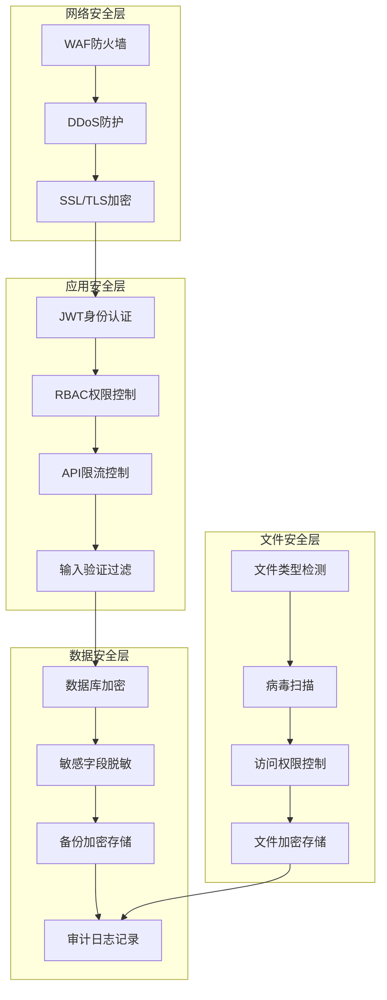

**安全防护说明：**

🌐 **网络安全层**：
- **WAF防火墙**：过滤恶意请求，防止SQL注入、XSS等攻击
- **DDoS防护**：抵御分布式拒绝服务攻击，确保服务可用性
- **SSL/TLS加密**：端到端数据传输加密，保护数据隐私

🛡️ **应用安全层**：
- **JWT身份认证**：无状态的令牌认证机制，支持分布式部署
- **RBAC权限控制**：基于角色的访问控制，精细化权限管理
- **API限流控制**：防止接口滥用，保护系统资源
- **输入验证过滤**：严格的数据校验，防止注入攻击

🔒 **数据安全层**：
- **数据库加密**：敏感数据字段级加密存储
- **敏感字段脱敏**：日志和备份中的敏感信息脱敏处理
- **备份加密存储**：备份数据采用独立密钥加密
- **审计日志记录**：完整的操作审计追踪

📁 **文件安全层**：
- **文件类型检测**：严格的文件格式验证，防止恶意文件
- **病毒扫描**：实时病毒检测，确保文件安全
- **访问权限控制**：基于用户身份的文件访问控制
- **文件加密存储**：重要文件静态加密存储

### 5.2 认证授权流程

以下时序图详细展示了系统的完整认证授权机制，包括SSO单点登录、API访问验证和令牌刷新等核心安全流程。

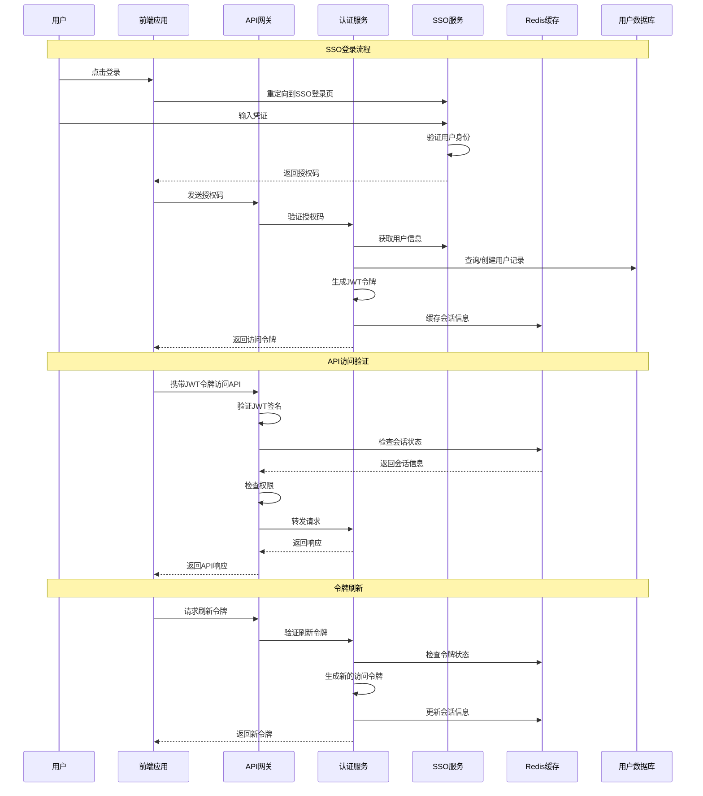

---

## 6. 部署架构设计

### 6.1 容器化部署架构

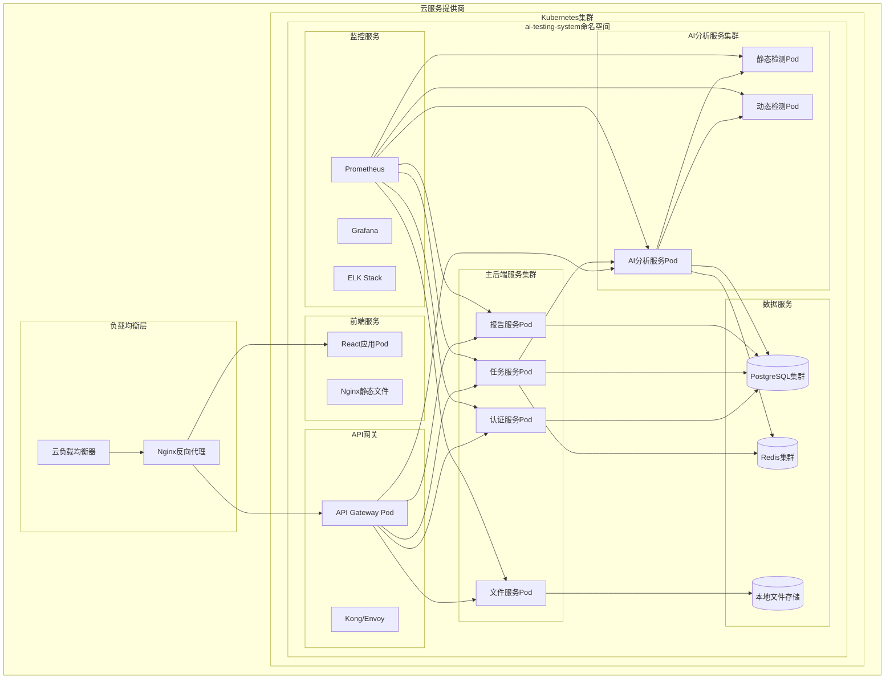

### 6.2 CI/CD流水线


### 6.3 环境配置管理

```yaml
# 生产环境配置示例
apiVersion: v1
kind: ConfigMap
metadata:
  name: ai-testing-config
  namespace: ai-testing-system
data:
  # 应用配置
  APP_ENV: "production"
  LOG_LEVEL: "INFO"
  
  # 数据库配置
  DATABASE_HOST: "postgresql-cluster.default.svc.cluster.local"
  DATABASE_PORT: "5432"
  DATABASE_NAME: "ai_testing_db"
  
  # Redis配置
  REDIS_HOST: "redis-cluster.default.svc.cluster.local"
  REDIS_PORT: "6379"
  
  # 文件存储配置
  FILE_STORAGE_PATH: "/app/data/files"
  FILE_UPLOAD_MAX_SIZE: "52428800"  # 50MB
  
  # AI服务配置
  OPENAI_API_BASE: "https://api.openai.com/v1"
  LANGCHAIN_TRACING: "true"
  
  # 安全配置
  JWT_ALGORITHM: "HS256"
  JWT_EXPIRE_MINUTES: "30"
  
  # 性能配置
  MAX_WORKERS: "4"
  MAX_FILE_SIZE: "52428800"  # 50MB
  TASK_TIMEOUT: "3600"       # 1小时
```

---

## 7. 监控和运维方案

### 7.1 监控体系架构

构建全方位的监控运维体系，实现从数据采集、存储处理到可视化展示和告警通知的完整闭环，确保系统稳定运行和及时响应。

**监控设计理念：**
- 📊 **全栈监控**：覆盖应用、系统、业务各个层面
- ⚡ **实时性**：秒级数据采集和分析
- 🔔 **主动告警**：智能告警策略，预防问题发生
- 📈 **数据驱动**：基于监控数据优化系统性能

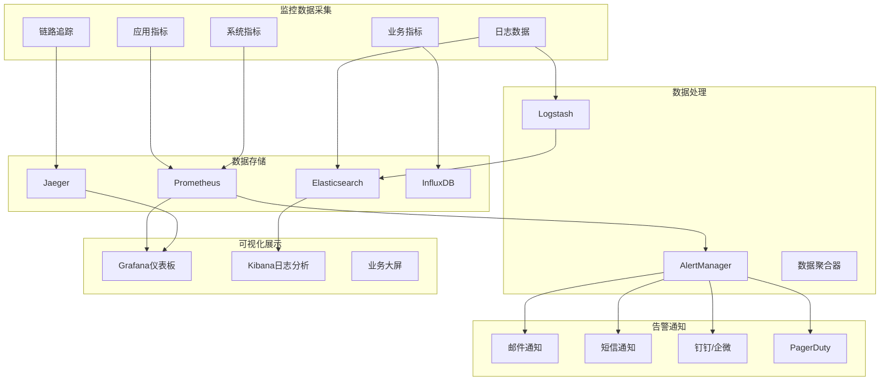

### 7.2 关键指标监控

| 监控类别 | 指标名称 | 阈值设置 | 告警级别 |
|---------|----------|----------|----------|
| **应用性能** | API响应时间 | >3秒 | WARNING<br/>>10秒 CRITICAL |
| **应用性能** | API错误率 | >5% | WARNING<br/>>10% CRITICAL |
| **系统资源** | CPU使用率 | >80% | WARNING<br/>>90% CRITICAL |
| **系统资源** | 内存使用率 | >85% | WARNING<br/>>95% CRITICAL |
| **系统资源** | 磁盘使用率 | >80% | WARNING<br/>>90% CRITICAL |
| **业务指标** | 任务执行成功率 | <95% | WARNING<br/><90% CRITICAL |
| **业务指标** | AI分析失败率 | >5% | WARNING<br/>>10% CRITICAL |
| **数据库** | 连接池使用率 | >80% | WARNING<br/>>90% CRITICAL |
| **数据库** | 慢查询数量 | >10/min | WARNING<br/>>50/min CRITICAL |

### 7.3 故障处理流程

建立标准化的故障处理流程，确保系统问题能够快速识别、及时响应和有效解决，最大化降低故障影响。

**故障响应机制：**
- 🚨 **分级响应**：根据告警级别触发不同的处理流程
- 🤖 **自动处理**：对于常见问题实现自动化修复
- 👥 **人工介入**：复杂问题快速升级到技术专家
- 📝 **事后总结**：完整的故障分析和改进措施

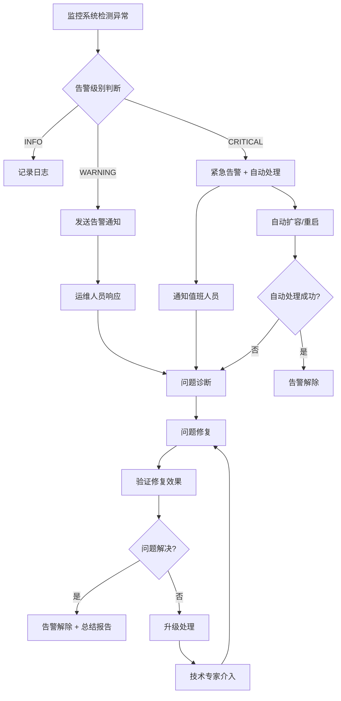

### 7.4 备份恢复策略

制定完善的数据备份和灾难恢复策略，确保关键业务数据的安全性和业务连续性，满足RTO和RPO要求。

**备份策略设计：**
- 🔄 **多级备份**：全量、增量、实时备份相结合
- 🌍 **异地容灾**：多地域备份，防范区域性灾难
- ⏱️ **定时调度**：自动化备份调度，减少人工干预
- 🔍 **备份验证**：定期验证备份文件完整性和可用性

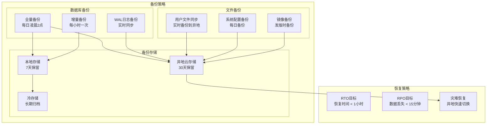

**备份恢复说明：**

💾 **备份分类**：
- **数据库备份**：全量备份保证数据完整性，增量备份减少存储空间，WAL日志提供实时恢复能力
- **文件备份**：用户文件实时同步，系统配置定期备份，镜像文件版本控制
- **存储管理**：本地短期保留，云端中期存储，冷存储长期归档

🎯 **恢复目标**：
- **RTO目标**：恢复时间目标小于1小时，确保快速恢复业务
- **RPO目标**：数据丢失目标小于15分钟，最大化保护业务数据
- **灾难恢复**：异地快速切换，保障业务连续性

🔧 **实施要点**：
- **自动化**：备份过程完全自动化，减少人为错误
- **监控**：备份状态实时监控，异常及时告警
- **测试**：定期进行恢复测试，验证备份有效性
- **文档**：完整的恢复操作手册和应急预案

---

## 📊 总结

本软件设计文档从技术栈优化、系统架构、数据设计、安全方案到部署运维，提供了AI资料自主测试系统的完整技术解决方案。

### 🎯 **核心优化点**
1. **统一异步架构** - 使用FastAPI + AsyncIO替代Celery，降低系统复杂度
2. **云原生设计** - 采用Kubernetes + 微服务架构，提升扩展性
3. **数据库优化** - 使用PostgreSQL的JSONB支持，更适合AI结果存储
4. **安全加固** - 多层安全防护，确保数据和系统安全
5. **监控完善** - 全方位监控告警，保障系统稳定运行

### 🚀 **实施建议**
1. **分期实施** - 按照微服务模块逐步实现和部署
2. **MVP验证** - 优先实现核心功能，快速验证技术方案
3. **性能测试** - 在生产环境部署前进行充分的压力测试
4. **团队培训** - 确保开发和运维团队熟悉新技术栈

### 🗂️ **文件存储方案说明**

#### 本地文件存储的优势
- ✅ **开发效率高** - 无需配置复杂的对象存储服务
- ✅ **成本低** - 前期无额外存储服务费用
- ✅ **调试简单** - 可直接查看文件系统内容
- ✅ **权限控制** - 基于文件系统权限，简单可靠

#### 注意事项与最佳实践
- 🔄 **定期备份** - 设置自动备份策略，防止数据丢失
- 📊 **磁盘监控** - 监控磁盘使用率，及时扩容
- 🔒 **权限管理** - 严格控制文件目录访问权限
- 📋 **日志记录** - 记录所有文件操作，便于审计

#### 扩展时机建议
- **文件总量 > 1TB** 时考虑对象存储
- **用户数 > 1000** 时考虑分布式存储
- **需要多地部署** 时必须使用对象存储

该设计方案在保证功能完整性的同时，大幅降低了初期开发和运维复杂度，具备良好的扩展性、可维护性和安全性，能够满足AI资料测试系统的长期发展需求。
